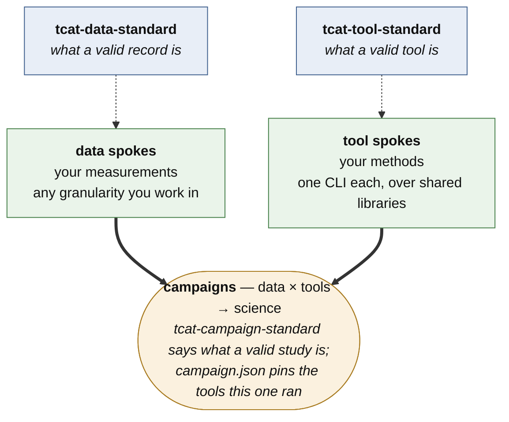

# TransientCatalysis

**Transient kinetics, operando spectroscopy, and agentic AI for catalyst and reactor design.**

We use rapid perturbations of reactor inlet gas — pseudo-random binary sequences and periodic pulses — to collect information-rich transient kinetic and operando spectroscopic data, and we train digital twins on it that predict steady-state and chemical-looping reactor performance from minutes of transient data rather than days of steady-state experiments. The AI layer spans a graded palette from neural ODEs to reduced-order microkinetic models, coupled to machine-learned spectroscopic sensor models that map signals to catalytic state variables such as surface coverage and oxidation state.

The current focus is oxidative dehydrogenation of light alkanes over supported vanadium oxides, including chemical-looping operation.

---

## Who we are

| Institution | Investigators | Contribution |
|---|---|---|
| **Pennsylvania State University** (lead) | Michael J. Janik, Robert M. Rioux, James M. Hodges | PRBS reactor kinetics, transient IR, catalyst synthesis |
| **Brookhaven National Laboratory** | Anatoly I. Frenkel | Modulation-excitation fast-scan XAS |
| **Georgia Institute of Technology** | Andrew J. Medford | Agentic AI kinetic fitting and workflow integration |
| **ExxonMobil** | Randall J. Meyer | Industrial partner |

## Repositories

> **Standard 0.3.0, schema 0.2.0, accepted by the team in September 2026 and now exercised against a real campaign** — 26 PSU CO-oxidation PRBS runs across four batches, ingested and validating. Six schema changes came out of that exercise rather than out of anticipation. It is still early enough to be cheap to argue about, so if something looks wrong, it probably is — please say so in an issue.

| Repository | What it is |
|---|---|
| **[`tcat-data-standard`](https://github.com/TransientCatalysis/tcat-data-standard)** | Defines what a valid **dataset** is. Ten document kinds, a validator, the ingestion contract. Small, boring, changes slowly — three institutions depend on it. **Public.** |
| **`tcat-tool-standard`** | Defines what a valid **tool** is. The contract, a machine-readable declaration per tool, the registries of names that get hashed into artifact ids, and a conformance checker. Holds no science. |
| **`tcat-campaign-standard`** | Defines what a valid **study** is: `campaign.json` as manifest and lockfile (pinned tool identities), the notebook kit and claim register, `tcat-campaign check`. |
| **`tcat-index`** | The project research database. Registries for artifacts, datasets, samples, models, and publications, with deposit, query, catalog, and public-export interfaces. Metadata only, no bytes. |
| **`tcat-kinetics`** | The kinetics **library**: mechanisms, integrators (gradientless, axially dispersed bed, error-controlled), transport, inlet reconstruction, thermochemistry. Mints nothing; every tool that imports it declares it, so its digest folds into the tool's identity. |
| **`tcat-fit`**, **`tcat-design`**, **`tcat-spec`**, **`tcat-ingest`**, **`tcat-report`** | One **tool** each -- one CLI, one repository, one owner -- implementing the declared tool of the same name. Identity `name@<version>+<digest8>`; `<cmd> --version` prints it. |
| **`tcat-calibrate-ms`** | The mass-spectrometer calibration chain, implementing `tcat-calibrate`. Instrument-specific by design and owned by the instrument lab. |
| **`tcat-data-psu-coox`** | The worked **data** exemplar: 26 real PSU CO-oxidation PRBS runs, validating 47/47. Private to the org. |
| **`tcat-campaign-coox`** | The first **campaign**: PSU's data x the tools above -> the M3/M9 evidence. `campaign.json` pins the seven identities it ran with; five executed notebooks; no tool implementations. Private to the org. |

## The picture



The same drawing for a terminal, a slide, or a notebook:

```
       tcat-data-standard                          tcat-tool-standard
         a valid RECORD                               a valid TOOL
                │                                           │
                ▼                                           ▼
           data spokes                                 tool spokes
       your measurements,                             your methods,
         any granularity                              one CLI each
                │                                           │
                └───────────────► campaigns ◄───────────────┘
                           data × tools → science
                       campaign.json pins what it ran
```

*Dotted: the standard each side conforms to. Solid: measurements and methods meeting in a study.*

**The top row is the part that must not move.** A standard per kind of thing, and **none of them
holds the thing itself** — the data standard holds no data, the tool standard holds no tools, the
campaign standard holds no science. A standard that accumulated what it defines would become the
place everyone edits, and then it is no longer something three institutions can build against.

**The bottom row is the part that is yours.** A data spoke is any repository whose records
validate, at whatever granularity you actually work in; a tool spoke is one CLI over shared
libraries. Nobody has to agree on how you work — only on what a valid record and a valid tool
look like. **Standardisation where it buys interoperability, freedom everywhere else**, and the
diagram is symmetric because the two sides genuinely are: same pattern, one standard and many
spokes, on data and on methods alike.

**Campaigns are where the two halves meet, and that join is the point: it decouples methods from
science.** A method is written once, in its own repository, and reused by every campaign that
wants it; a campaign swaps a method — or a dataset — without touching either. What a campaign
adds is the record of which was combined with which: `campaign.json` pins the exact identity of
every tool it ran, so a study stays reproducible without the tools having to be frozen.

Off this picture deliberately, because it is the idea rather than the wiring: **libraries** (code
several tools import, minting nothing, folded into each tool's identity), the content-addressed
**store** the artifacts land in, and **`tcat-index`**, the registry that records who has what.
`tcat-tool-standard/ARCHITECTURE.md` carries this drawing and the detailed one beside it.

## Where to start

**New here, and not sure?** Read [`COLLABORATION.md`](https://github.com/TransientCatalysis/.github/blob/main/COLLABORATION.md) — who owns what, what a pull request has to carry, and how to coach an agent working in these repositories. Then pick one of the two tracks below; each is one page and ends at a working spoke.

**Depositing data?** `pip install git+https://github.com/TransientCatalysis/tcat-data-standard.git`, then `tcat-spoke init --kind data <your-repo>` -- the skeleton ships inside the standard; there is no template to clone. `--kind tool` and `tcat-campaign init` do the same for a tool spoke and a campaign.

**Looking for data?** `tcat-index` is the registry. `catalog.json` is one flat file listing everything; `query.py` searches by sample, batch, lineage, modality, objective, or DOI, walks a provenance chain back to raw, and tells you what a revised calibration just invalidated.

**Writing a tool?** `tcat-spoke init --kind tool <your-repo>` writes a complete, conforming skeleton from the installed tool standard; replace the example body. Read its `START-HERE.md` first -- the honest first question is whether to connect anything yet or stay in `sandbox/`.

**Reading from outside the project?** Start with [`STANDARD.md`](https://github.com/TransientCatalysis/tcat-data-standard/blob/main/STANDARD.md). It is the design document, and each rule says why it exists rather than only what it requires.

## Six ideas that shape everything here

**A raw signal and a derived quantity are different things.** A mass-spec ion current is not a concentration. The sensor model between them is a separate, versioned, content-addressed artifact, and every derived trace cites both its raw input and the calibration that produced it. So when someone finds an m/z 44 artifact eighteen months later, you swap one calibration id, re-derive every affected trace, and the store tells you exactly which downstream fits went stale.

**Flag, never delete.** Failed and flagged runs are retained with a stated reason. A deleted failed run cannot be counted in an exclusion table at publication time, and exclusion criteria with counts are a reporting requirement.

**Store the sample, not the summary.** Parameter uncertainty is stored as a sample, with a covariance matrix treated as a derived summary. Gaussian summaries discard exactly the correlation structure that drives experimental design — and frequentist fits emit an ensemble in the same shape a sampler would, so experiment design needs one pathway rather than two.

**Contracts are checked, not claimed.** A tool "conforms" when a checker has run it and confirmed the behaviour — one artifact id on stdout, deterministic ids, a dry run that does no work, an atomic commit. `tcat-conform` never imports the code it checks, which is what lets a tool in any language be held to the same standard, and what keeps the contract from quietly becoming Python-only.

**Say how much weight to put on it.** Every record carries a `maturity` rung — `sandbox`, `working`, `reviewed`, `published`, or `superseded` — and each rung has an entry criterion a validator checks rather than a claim somebody makes. Absence means `sandbox`, which is the honest default and costs nothing. It is deliberately *not* the same question as whether the run succeeded (`status`), who may see it (`access_status`), or how supervised the work was (`autonomy_level`); all four vary independently, and the standard has the table.

**Splits are groups, not rows.** A model records which `batch_id` and `lineage_id` values went into train, validation, and test — so a validator can *fail* when a group appears in two of them. Catalysis data has shared lineages and repeated conditions, so a row-level split of an autocorrelated transient leaks and looks fine.

## Standards

Our data model is a **profile of** [TRACE-AI](https://github.com/trace-ai-org/trace-ai-checklist) (v2.2.0), not an invention alongside it — see [`profiles/trace-ai/`](https://github.com/TransientCatalysis/tcat-data-standard/tree/main/profiles/trace-ai) for the field-by-field crosswalk and what we deliberately do differently.

> Xin, H. *et al.* "Transparent reporting for agentic catalysis enabled by artificial intelligence: Community guidelines and a publication checklist." *Chem Catalysis* (2026). [10.1016/j.checat.2026.101755](https://doi.org/10.1016/j.checat.2026.101755)

Transient kinetics, stiff solvers, and model-based experiment design are genuinely underspecified upstream, which is written around steady-state screening and closed-loop synthesis. A transient-kinetics profile contributed back is a planned output of this work — the concrete candidates are parameterised perturbation waveforms that are exactly regenerable, time-base alignment across simultaneously-acquired modalities, sensor models as versioned citable artifacts, and split assignments expressed as groups.

## Licensing

Research software **MIT**. Documentation, tutorials, and example workflows **CC-BY-4.0**. Public datasets **CC-BY-4.0**, or **CC0-1.0** where unrestricted reuse is preferred and permitted. Releases are archived to a DOI-minting service and reported to DOE OSTI.

## Acknowledgment

Supported by the U.S. Department of Energy **Genesis Mission**, DE-FOA-0003612 — *Transient Kinetics and Spectroscopy for Agentic Digital Twins to Upgrade Domestic Alkane Feedstocks into Value-Added Chemicals* (Phase I).
